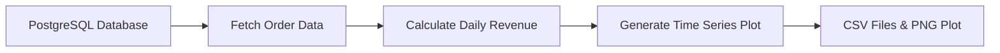

# End-to-End Retail Data Pipeline

## 📋 Project Overview

This project demonstrates a complete data engineering pipeline using Apache Airflow for daily sales revenue analysis. The pipeline extracts data from a PostgreSQL database, processes it to calculate daily revenues, and generates visualizations.

## 🏗️ Architecture

The project implements an ETL (Extract, Transform, Load) pipeline with the following components:

- **Data Source**: PostgreSQL database with orders, order_details, and products tables
- **Orchestration**: Apache Airflow for workflow management
- **Processing**: Python with pandas for data transformation
- **Visualization**: Matplotlib for time series plotting
- **Storage**: CSV files for intermediate and final outputs

## 🚀 Features

- **Automated Daily Processing**: Scheduled to run daily at midnight
- **Data Extraction**: Fetches order data from PostgreSQL
- **Revenue Calculation**: Computes daily total revenue from quantity × price
- **Time Series Visualization**: Generates plots showing revenue trends over time
- **Error Handling**: Built-in retry mechanism with 2-minute delays
- **Modular Design**: Separate tasks for each processing step

## 📁 Project Structure

```
Data Engineering course/
├── airflow/                          # Apache Airflow configuration
│   ├── dags/
│   │   └── capstone_project.py       # Main DAG definition
│   ├── logs/                         # Airflow execution logs
│   └── airflow.cfg                   # Airflow configuration
├── airflow_output/                   # Generated outputs
│   ├── daily_sales_data.csv          # Raw order data
│   ├── daily_revenue_data.csv        # Processed revenue data
│   └── daily_revenue_plot.png        # Time series visualization
└── README.md                         # This file
```

## 🔧 Prerequisites

- Python 3.7+
- Apache Airflow 2.0+
- PostgreSQL database
- Required Python packages:
  - pandas
  - numpy
  - matplotlib
  - psycopg2 (for PostgreSQL connection)

## ⚙️ Setup Instructions

1. **Install Apache Airflow**:
   ```bash
   pip install apache-airflow
   ```

2. **Configure PostgreSQL Connection**:
   - In Airflow UI, go to Admin → Connections
   - Create a new connection with ID: `postgres_conn`
   - Configure your PostgreSQL database credentials

3. **Place DAG File**:
   - Copy `capstone_project.py` to your Airflow DAGs folder
   - Ensure the file is in the correct location: `airflow/dags/`

4. **Create Output Directory**:
   ```bash
   mkdir -p /home/kiwilytics/airflow_output
   ```

## 🎯 DAG Tasks

The pipeline consists of three sequential tasks:

### 1. `fetch_orders_data`
- **Purpose**: Extract order data from PostgreSQL
- **Input**: PostgreSQL database (orders, order_details, products tables)
- **Output**: `daily_sales_data.csv`
- **Query**: Joins orders, order_details, and products tables

### 2. `calculate_total_revenues`
- **Purpose**: Calculate daily revenue totals
- **Input**: `daily_sales_data.csv`
- **Output**: `daily_revenue_data.csv`
- **Processing**: Groups by sales_date and sums total_revenue

### 3. `plot_revenues`
- **Purpose**: Generate time series visualization
- **Input**: `daily_revenue_data.csv`
- **Output**: `daily_revenue_plot.png`
- **Visualization**: Line plot with markers showing revenue trends

## 📊 Data Flow



## 🚦 Running the Pipeline

1. **Start Airflow**:
   ```bash
   airflow webserver --port 8080
   airflow scheduler
   ```

2. **Access Airflow UI**:
   - Open browser to `http://localhost:8080`
   - Login with default credentials (admin/admin)

3. **Trigger DAG**:
   - Find `daily_sales_revenue_analysis` DAG
   - Toggle it ON to enable automatic scheduling
   - Or manually trigger a run

## 📈 Output Files

- **`daily_sales_data.csv`**: Raw extracted data with columns:
  - `sales_date`: Date of the order
  - `quantity`: Number of items ordered
  - `price`: Price per item

- **`daily_revenue_data.csv`**: Processed data with columns:
  - `sales_date`: Date of the order
  - `total_revenue`: Total revenue for that day

- **`daily_revenue_plot.png`**: Time series visualization showing revenue trends

## 🔍 Monitoring

- **Airflow UI**: Monitor task execution, logs, and DAG status
- **Logs**: Check `airflow/logs/` for detailed execution logs
- **Output Files**: Verify generated CSV and PNG files in `airflow_output/`

## 🛠️ Customization

### Modify Schedule
```python
# In capstone_project.py
schedule_interval='@daily'  # Change to '@hourly', '0 2 * * *', etc.
```

### Add More Metrics
Extend the `process_daily_revenue()` function to calculate additional metrics like:
- Average order value
- Number of orders per day
- Top-selling products

### Change Output Format
Modify the visualization in `time_series_plot()` to create different chart types:
- Bar charts
- Area charts
- Multiple metrics on same plot

## 🐛 Troubleshooting

### Common Issues

1. **PostgreSQL Connection Error**:
   - Verify connection ID matches `PG_CONN_ID`
   - Check database credentials in Airflow connections

2. **File Path Errors**:
   - Ensure output directory exists and is writable
   - Check file permissions

3. **Import Errors**:
   - Install required Python packages
   - Verify Airflow environment setup

### Logs Location
- DAG logs: `airflow/logs/dag_id=daily_sales_revenue_analysis/`
- Scheduler logs: `airflow/logs/scheduler/`

## 📚 Learning Outcomes

This project demonstrates:
- **ETL Pipeline Design**: Complete data extraction, transformation, and loading process
- **Workflow Orchestration**: Using Apache Airflow for task scheduling and dependency management
- **Data Processing**: Python pandas for data manipulation and analysis
- **Visualization**: Creating meaningful charts from processed data
- **Error Handling**: Implementing retry mechanisms and proper logging
- **Production Practices**: Modular code design and configuration management

## 👨‍💻 Author

Ahmed Emad

